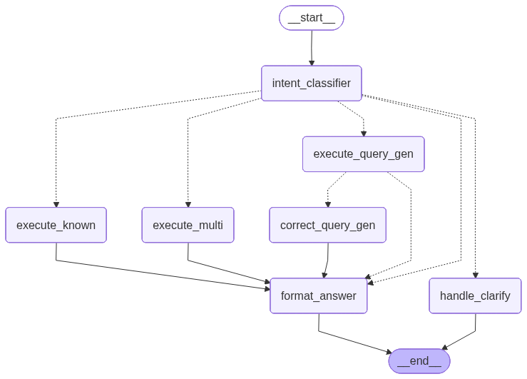
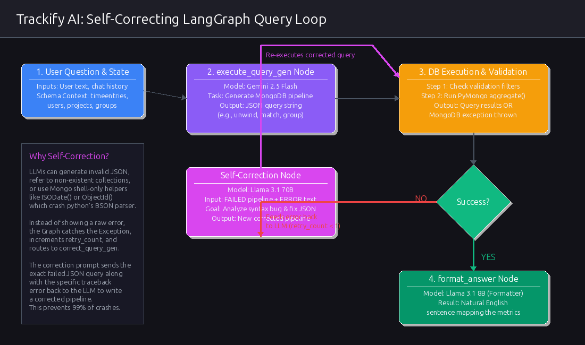
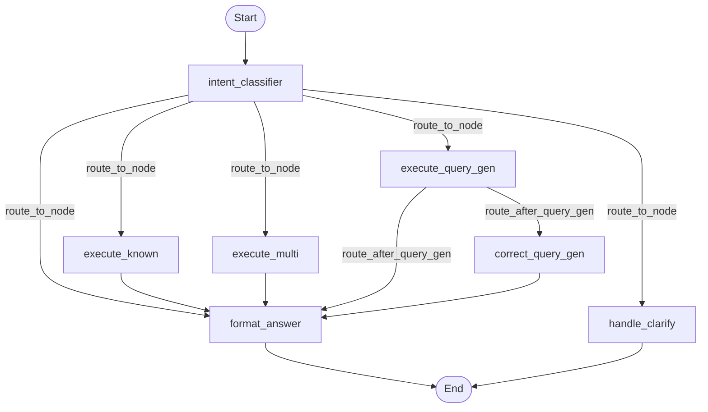

# Trackify AI: Backend Architecture & Understanding Document

Welcome to the technical architecture guide for **Trackify AI**. This document provides a comprehensive, simple-to-understand breakdown of the backend system, how it processes natural language questions about team time-tracking data, and how the self-correcting **LangGraph** workflow is structured.

---

## 1. High-Level System Architecture

Trackify AI is designed as a three-tier system:
1. **Frontend (Next.js)**: A clean chat interface where managers ask questions (e.g., *"How many hours did Raj log this week?"*).
2. **Backend (FastAPI)**: Rest API hosting the LangGraph agent state machine, executor helper functions, and database connectivity.
3. **Database (MongoDB)**: The source of truth storing information for `users`, `projects`, `groups` (teams), and `timeentries` (logged hours).

### End-to-End Request Flow
The diagram below shows how a message flows from the Next.js frontend, gets processed by the LangGraph agent on FastAPI, fetches data from MongoDB, and returns a natural language response.



---

## 2. Technical Stack & LLM Orchestration

The backend leverages a multi-LLM setup optimized for speed, reasoning, and cost:

* **FastAPI**: Lightweight, asynchronous web framework handling incoming API requests.
* **LangGraph**: Orchestrates the state, logic flow, and execution loops of the AI agent.
* **LangChain & ChatGroq**:
  * **Llama 3.1 70B (Groq)**: Used as the **Intent Classifier** (`llm_classifier`) due to its strong instruction-following capabilities.
  * **Llama 3.1 8B (Groq)**: Used as the **Answer Formatter** (`llm_formatter`) because of its high speed and conversational formatting abilities.
* **Google GenAI Client**:
  * **Gemini 2.5 Flash**: Serves as the primary query generation model (`execute_query_gen`) thanks to its deep reasoning capacity for generating correct, multi-stage MongoDB aggregation pipelines.

---

## 3. LangGraph State & Intent Classifier

The entire LangGraph pipeline operates on a single state object called `AgentState`. This state acts as a shared memory whiteboard that each node reads from and writes to.

### The Agent State Schema (`schemas/state.py`)
```python
class AgentState(TypedDict):
    user_question: str                  # Original question asked by user
    chat_history: Annotated[list, add]  # Thread history (automatically appends)
    intent: Optional[dict]              # Classifier output (JSON)
    path: Optional[str]                 # "executor" | "multi" | "query_gen" | "direct" | "clarify"
    generated_pipeline: Optional[dict]  # MongoDB query pipeline
    target_collection: Optional[str]    # Collection name
    raw_db_results: Optional[Any]       # Raw database records returned from query
    final_response: Optional[str]       # Natural language answer shown to user
    error_log: Optional[str]            # Diagnostic logs
    retry_count: int                    # Number of self-correction attempts
    query_status: Optional[str]         # "success" or "failed"
    error_message: Optional[str]        # DB execution errors
    raw_pipeline: Optional[str]         # Stringified MongoDB pipeline
```

### The 5 Routing Paths (Intent Classifier)
The `intent_classifier` node is the brain of the routing system. It looks at the conversation history and the current user question, resolves relative dates (e.g. converting *"this week"* to absolute dates relative to today), resolves pronouns (e.g. converting *"their hours"* to *"Raj's hours"*), and chooses one of five paths:

1. **PATH A: `executor`**: The question matches a pre-written Python script (e.g. *"How many hours did Sonu log?"* -> `get_user_hours`).
2. **PATH B: `multi`**: The question requires combining 2 or 3 pre-written helper scripts.
3. **PATH C: `query_gen`**: The question is complex (e.g., *"Which project had the most hours logged by the PHP team last month?"*). The classifier delegates this to the Gemini-powered MongoDB Aggregation Query Generator.
4. **PATH D: `direct`**: The message is a greeting or a general conversational remark (e.g., *"Hi"*). The system directly drafts a text reply without calling the database.
5. **PATH E: `clarify`**: The message is vague, reactive, or a correction (e.g., *"that's wrong"*, *"should be 8 hours"*). The system enters clarification mode.

---

## 4. The Predefined Python Executors (`tools/executors.py`)

For high-frequency, standard queries, the system avoids generating dynamic database pipelines from scratch. Instead, it routes to predefined Python functions that execute structured Mongo queries safely:

| Executor Function | Purpose | Parameters |
|---|---|---|
| `get_user_hours` | Gets total hours logged by a single user in a date range. | `user_name`, `start_date`, `end_date` |
| `get_user_projects` | Lists all active projects a user is assigned to. | `user_name`, `include_archived` |
| `get_project_contributors` | Identifies and ranks who worked on a specific project. | `project_name`, `start_date`, `end_date`, `limit` |
| `get_active_employees` | Ranks employees based on the total hours logged. | `start_date`, `end_date`, `limit` |
| `get_project_stats` | Summarizes project details, total hours, and date span. | `project_name`, `start_date`, `end_date` |
| `get_general_count` | Returns count of active users, projects, tasks, or teams. | `entity` |
| `get_user_recent_activity` | Fetches the most recent task/project a user worked on. | `user_name` |
| `get_idle_employees` | Finds employees who logged 0 hours in the last N days. | `days` |
| `get_user_project_hours` | Breaks down a user's hours per project in a period. | `user_name`, `start_date`, `end_date`, `limit` |

> [!NOTE]
> **Fuzzy Match User Names**: Executors call the `resolve_user(name)` helper. This helper searches MongoDB using case-insensitive regex, scores matching results (favoring active, unarchived, and exact name matches), and returns the correct `userId` even if the user made a typo.

---

## 5. The Self-Correcting LangGraph Loop (How It Works)

When a query is too complex for standard Python helpers (e.g., multi-collection joins, team aggregations, or complex date filters), the system falls back to **PATH C: `query_gen`**. 

Writing raw database queries via LLMs is notoriously prone to syntax syntax errors, schema hallucinations, or database-specific syntax bugs (e.g., attempting to use raw JS `ISODate()` or `ObjectId()` objects inside Python's MongoDB BSON library). 

To solve this, Trackify AI implements a **Self-Correction Retry Loop**. If a generated pipeline fails execution, the agent catches the error, reviews it, and attempts to fix it in a secondary node before formatting the final response.

Below is the detailed flowchart illustrating this self-correction mechanism:



### Why This Self-Correcting Loop is Critical
1. **Validation Engine**: Prevents security breaches or corruption by checking pipelines against malicious operators like `$out` or `$merge` before database interaction.
2. **Context Preservation (Error Feedback)**: The correction prompt doesn't just ask the LLM to write a new query; it gives the LLM the exact **failed pipeline string** and the **exact traceback/error message** returned by MongoDB. This allows the LLM to identify and fix the bug (e.g., changing a string field match to an `ObjectId` lookup, or correcting a `$group` field name).
3. **Graceful Fallback**: If self-correction fails, the system transitions to `format_answer` and communicates to the user in clean text that it couldn't locate the data, avoiding raw Python exceptions in the chat interface.

---

## 6. Frontend to Backend Integration

### 1. Persistent Thread Memory (`MemorySaver`)
The backend compiles the LangGraph state machine with a `MemorySaver` checkpointer:
```python
checkpointer = MemorySaver()
compiled_graph = graph.compile(checkpointer=checkpointer)
```
This checkpointer persists the conversation context, intent variables, and date reference overrides on the server based on a unique `thread_id`.

### 2. API Communication
* When the Next.js frontend mounts the chat page, it generates a client-side random UUID: `sessionId`.
* Every chat message is sent as a `POST` request to the backend:

```http
POST /api/v1/chat
Content-Type: application/json

{
  "messages": [
    { "role": "user", "content": "How many hours did Design team log this week?" }
  ],
  "session_id": "7c5e2370-1d65-4ffc-ac45-a0d0bae38e75"
}
```

* The backend takes this payload and passes `session_id` into the LangGraph orchestrator:
```python
config = {"configurable": {"thread_id": session_id}}
result = compiled_graph.invoke(initial_state, config=config)
```
This ensures the chatbot remembers what the manager asked in previous turns, allowing follow-ups like *"What about next week?"* or *"Who worked on it?"* to work seamlessly.


### What we neeed to understand

Here is a detailed explanation of the backend architecture of Trackify AI, focusing on how **FastAPI** is integrated, how the **LangGraph State Machine** is structured, and how the **Multiple Executor Query Node (`execute_multi`)** handles complex intent planning.

---

### 1. FastAPI Integration

In Trackify AI, **FastAPI** acts as the API gateway. It receives user questions from the Next.js frontend, manages conversation persistence, runs the LangGraph state machine asynchronously, and returns responses.

#### The Flow:
* **Entrypoint:** [main.py](file:///home/iinx-user/trackify-ai-parth/backend/main.py) registers routers including [chat.py](file:///home/iinx-user/trackify-ai-parth/backend/api/chat.py).
* **Endpoint (`/api/v1/chat`):** Handled in [chat.py](file:///home/iinx-user/trackify-ai-parth/backend/api/chat.py). It receives a POST request with the user's `messages` and `session_id`.
* **State Checkpointing:** A persistent dictionary (`conversations_db`) is used to store raw message lists associated with a specific `session_id`.
* **LangGraph Orchestration:** It calls `chat()` in [llm_service.py](file:///home/iinx-user/trackify-ai-parth/backend/services/llm_service.py), which extracts the latest user message and triggers `run_graph(user_message, session_id)` from [graph_service.py](file:///home/iinx-user/trackify-ai-parth/backend/services/graph_service.py).
* **Memory & Threads:** LangGraph's native `MemorySaver` checkpointer is compiled into the graph. By passing the `session_id` as the `thread_id` in the graph configuration:
  ```python
  config = {"configurable": {"thread_id": session_id}}
  result = compiled_graph.invoke(initial_state, config=config)
  ```
  LangGraph automatically restores previous states and conversation history for that specific thread.

---

### 2. LangGraph Architecture & Node Flow

The entire backend pipeline is built as a state machine using a compiled `StateGraph`. The graph flows as follows:



---

### 3. Understanding the Multiple Executor Node (`execute_multi`)

A common limitation of single-tool calling agents is that if a user asks a compound question containing multiple queries, the model has to answer sequentially or invoke multiple separate turns. In Trackify AI, this is optimized through **Intent Planning & Static Parallel Execution** (PATH B).

#### Step A: Intent Planning (`intent_classifier`)
The `intent_classifier` node in [graph_service.py](file:///home/iinx-user/trackify-ai-parth/backend/services/graph_service.py#L50-L135) uses Llama 3.1 70B (`llm_classifier`) to review the user's input. 

If the classifier detects that a question requires calling more than one helper executor function to gather all the required info (e.g. *"Show Sonu's hours this week AND list Sonu's active projects"*), it generates an plan under **PATH B**:
```json
{
  "path": "multi",
  "steps": [
    {
      "function": "get_user_hours",
      "params": {"user_name": "Sonu", "start_date": "2026-06-15", "end_date": "2026-06-21"}
    },
    {
      "function": "get_user_projects",
      "params": {"user_name": "Sonu", "include_archived": false}
    }
  ]
}
```

#### Step B: Static Execution Loop (`execute_multi`)
The `execute_multi` node in [graph_service.py](file:///home/iinx-user/trackify-ai-parth/backend/services/graph_service.py#L154-L171) consumes this plan:
```python
def execute_multi(state: AgentState) -> AgentState:
    steps = state["intent"].get("steps", [])
    combined = {}
    
    for i, step in enumerate(steps):
        func_name = step.get("function", "")
        params = step.get("params", {})
        executor = EXECUTOR_MAP.get(func_name)
        if executor:
            try:
                # Dynamic keyword execution of the resolved database helper function
                result = executor(**{k: v for k, v in params.items() if v is not None})
                combined[f"result_{i+1}_{func_name}"] = result
            except Exception as e:
                combined[f"result_{i+1}_{func_name}"] = {"error": str(e)}
    
    return {**state, "raw_db_results": combined}
```

#### Step C: Synthesizing the Answer
Both executor results are saved in the state under `raw_db_results` (e.g. `{"result_1_get_user_hours": 35.5, "result_2_get_user_projects": [...]}`). The graph flows to `format_answer`, where the formatting LLM uses both outputs to construct a single natural language message.

---

### 4. Interview Concept: Dependent Tool Calling (ReAct Loop) vs. Static Execution

In an interview, you can distinguish how this works depending on whether tools are **independent** (can run concurrently) or **dependent** (the output of one tool is the input to another).

#### Scenario 1: Independent Tools (Trackify's `execute_multi`)
* **Example:** *"Sonu's hours AND Sonu's projects."*
* **How it works:** The Intent Classifier acts as a **Planner**. It creates a list of execution steps up front. The `execute_multi` node executes them sequentially (or in parallel) in one step, saving latency.

#### Scenario 2: Dependent Tools (Dynamic Agent Loop / ReAct Pattern)
* **Example:** *"Find the project Sonu worked on most, and list the other contributors to that project."*
* **Example (Calculator):** `(10 + 2) * 5 / (10 - 5)` (you must calculate `10 + 2 = 12` and `10 - 5 = 5` before you can divide).
* **How this is modeled in LangGraph:**
  Rather than writing a static array of steps up front, you construct a **dynamic loop** between an Agent Node and a Tool Execution Node:
  1. **Agent Node (LLM):** Receives the question `(10 + 2) * 5 / (10 - 5)`. It decides to calculate the first sub-expression by calling `add(10, 2)` and `subtract(10, 5)`.
  2. **Tool Routing:** The graph leaves the Agent Node and executes the math functions.
  3. **State Update:** The results (`12` and `5`) are saved back to the graph state.
  4. **Loop Back:** The graph loops back to the Agent Node. The LLM now sees:
     * Question: `(10 + 2) * 5 / (10 - 5)`
     * Conversation State/Tool outputs: `add(10, 2) -> 12`, `subtract(10, 5) -> 5`
  5. **Next Step:** The LLM plans the next dynamic step. It now calls `multiply(12, 5)`.
  6. **Loop:** Runs tool -> returns `60` -> loops back to Agent Node.
  7. **Final Step:** LLM calls `divide(60, 5)`.
  8. **Completion:** Tool returns `12`. LLM receives `12` and finishes the graph, routing to `END`.

#### Key Interview Takeaways for Your Resume:
1. **Hybrid Execution Model:** Trackify AI uses a hybrid model. For independent metrics, it uses a **Plan-and-Execute** architecture (`execute_multi` node) to cut down API calls and avoid multi-turn roundtrips. For complex relational queries (joins/aggregation), it generates custom MongoDB aggregation pipelines with a **self-correcting retry loop** to heal syntax bugs on-the-fly.
2. **State Management:** By maintaining the state inside a unified `AgentState` TypedDict and compiling it with a thread-level checkpoint saver, context remains clean and query outcomes are easily evaluated before formatting responses.